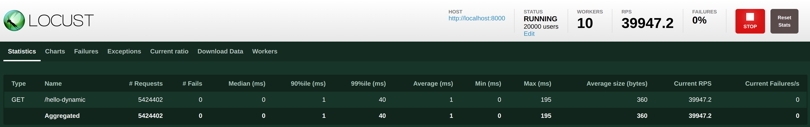
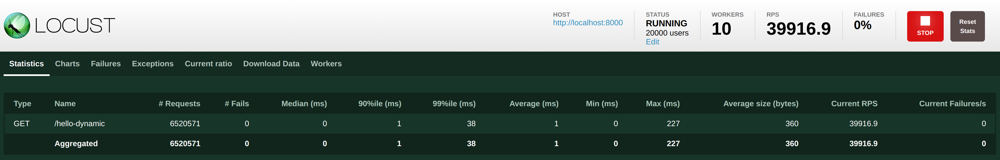

class: center, inverse
name: title

.main-logo[]

# Vert.x Spring Boot Integration

---

## Brief Intro about Eclipse Vert.x

--

* Eclipse Vert.x is a tool-kit for building reactive applications on the JVM.

--

* Being a toolkit (not a framework), it is naturally very composable and embeddable.

--

* Doesn't have a strong opinion for the application structure.

---

## Why Integrate Vert.x with Spring Boot

--

* Dependency Injection support.

--

* Easier Configurations management.

--

* Best of both worlds
    * Spring provides unique features to maintain large projects with ease.
    * Eclipse Vert.x provides solid performance to build reactive web applications.

---

class: center, middle, inverse

# Implementation

[//]: <> (TODO: Add Youtube Link)

---

## Implementation Details

--

.center[.vertx-implementation[]]

--

* Spring Boot initialize the application except the HTTP Server.

--

* Post Bootstrapping, Spring Boot triggers Vert.x initialization.

--

* Vert.x initialize and binds the port for the HTTP Server.

---

class: center, middle, inverse

# Metrics Comparison

---

## Metrics Comparison

.xl-space[

### .center[Startup Time]

]
.center[
| | Vert.x | Vert.x with Spring |
|---------------------|---------|---------------------|
| .bold[Time (in ms)] | 189 | 266 |
]

---

## Metrics Comparison

.xl-space[

### .center[Fat Jar Size]

]
.center[
| | Vert.x | Vert.x with Spring |
|---------------------|---------|----------------------|
| .bold[Size (in MB)] | 6.6 | 16.2 |
]

---

class: rps-comparison

## Metrics Comparison

.s-space[

### .center[RPS (Static Response)]

]
.s-space[
.center[
| | Vert.x | Vert.x with Spring |
|------------------------|---------|--------------------|
| .bold[RPS 20000 Users] | 39935.6 | 39912.7 |
]
]
.s-space[

##### Vert.x

]
.center[.load-test[]]
.s-space[

##### Vert.x with Spring

]
.center[.load-test[]]

---

class: rps-comparison

## Metrics Comparison

.s-space[

### .center[RPS (Dynamic Response)]

]
.s-space[
.center[
| | Vert.x | Vert.x with Spring |
|------------------------|---------|--------------------|
| .bold[RPS 20000 Users] | 39947.2 | 39916.9 |
]
]
.s-space[

##### Vert.x

]
.center[.load-test[]]
.s-space[

##### Vert.x with Spring

]
.center[.load-test[]]

---

class: center, middle, inverse

# Thank you for watching

[//]: <> (TODO: Add Youtube Link)
